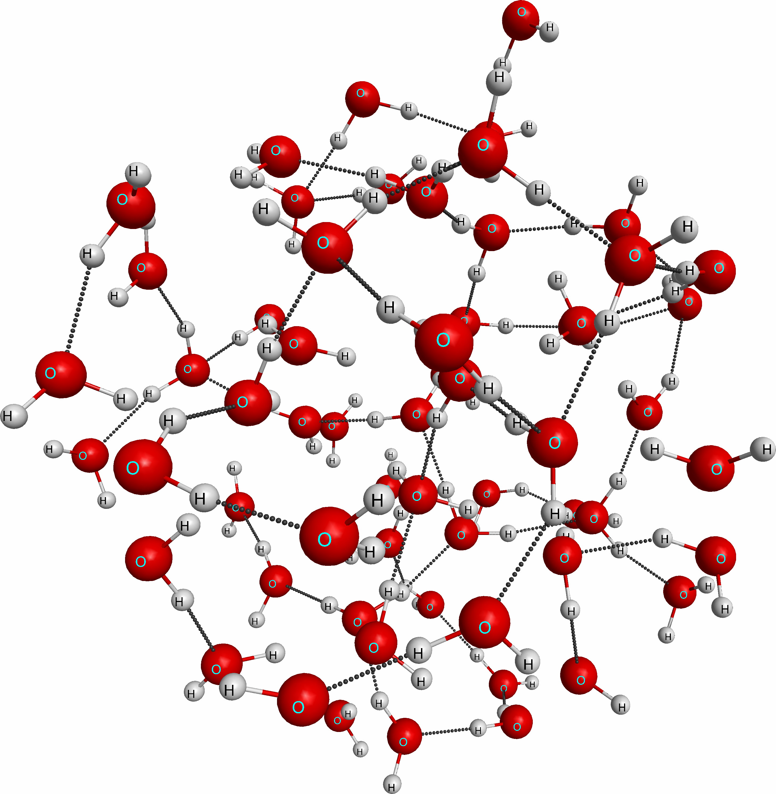
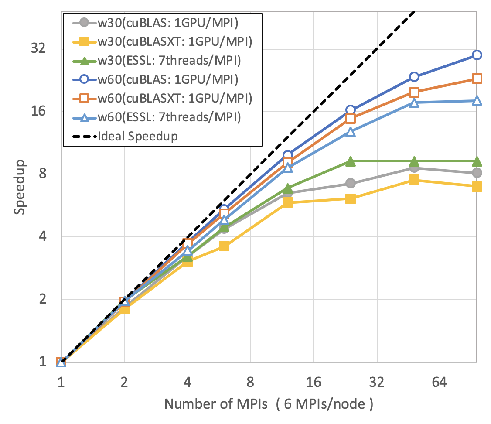
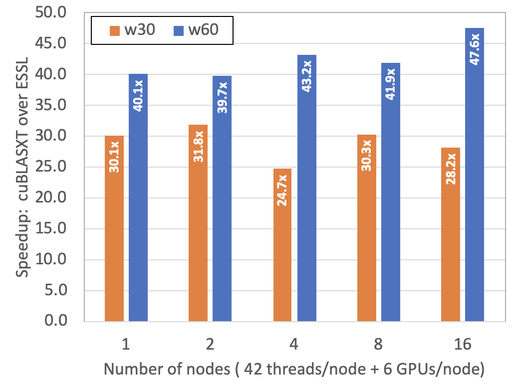

# GAMESS RI-MP2 mini-app for SC20 Roofline tutorial

This is a simplifed version of GAMESS RI-MP2 mini-app for SC20 Roofline tutorial.  
For more details about GAMESS RI-MP2 mini-app, please visit the following github repository:  
https://github.com/jkwack/GAMESS_RI-MP2_MiniApp

General Atomic and Molecular Electronic Structure System (GAMESS) 
is a popular quantum chemistry software package 
which has been around since the 1980s. 
It can calculate a wide variety of molecular properties 
using electronic structure methods. 
One of the methods implemented in GAMESS is 
resolution of identity Moller-Plesset perturbation (RI-MP2) theory. 
RI-MP2 is an electron correlation method, 
which is a class of methods 
that include instantaneous electron-electron interactions, 
and are required to perform accurate energy and property calcula- tions for certain classes of molecular systems. 
Of the electron correlation methods, 
RI-MP2 tends to be one of the more computationally inexpensive methods, 
but the formal computational complexity is still O(N5), 
where N is a measure of system size.   

The __GAMESS RI-MP2 mini-app__ computes 
__the correlation energy__
with the Hartree-Fock energy and wave-function given as inputs. 
The inputs were generated from GAMESS. 

## Inputs for GAMESS RI-MP2 mini-app

### Input data sets from GAMESS
Input data sets for GAMESS RI-MP2 mini-app include several fundamental parameters 
(e.g., the number of atomic orbital (N) and auxiliary (X) basis functions, 
the number of correlated occupied (O) and virtual (V) molecular orbitals), 
the molecular orbital coefficients, the molecular orbital energies, 
and 3-index integral matrix B(X,V,O)), and the calculated MP2 correlation energy for validation. 
The following input data sets were generated from GAMESS:
* benz.kern for Benzene
* cor.kern for Coronene
* c60.kern for Fullerene
* w30.kern for 30 water clusters
* w60.kern for 60 water clusters

In this git repository, there is only one input file, benz.kern.
It is the smallest input. You can find bigger inputs at the following link:  
[https://anl.box.com/v/GAMESS-RI-MP2-Inputs](https://anl.box.com/v/GAMESS-RI-MP2-Inputs)  
On NVIDIA V100 GPUs, we recommend to use c60.kern, w30.kern, or w60.kern inputs to see meaningful speedups. 

| cor.kern  | c60.kern  | w60.kern  |
| :-:       |:-:        | :-:       |
| | |   |

### Arbitrary data sets with the same data structures as the above inputs
The above data sets require significant I/O times before computing the correlation energy. They are not necessary in actual GAMESS workloads. In order to avoid the unnecessary I/O time, the following arbitrary data sets can be generated via the initialization process:
* benz.rand: an arbitrary data with the same data structure of benz.kern
* cor.rand: an arbitrary data with the same data structure of cor.kern
* c60.rand: an arbitrary data with the same data structure of c60.kern
* w30.rand: an arbitrary data with the same data structure of w30.kern
* w60.rand: an arbitrary data with the same data structure of w60.kern

## Running GAMESS RI-MP2 mini-app

### Intel DevCould

#### Build the executables
    $ git clone --single-branch --branch tutorial-SC20 https://github.com/jkwack/GAMESS_RI-MP2_MiniApp.git
    $ cd GAMESS_RI-MP2_MiniApp/CPP/
    $ source source_me_SC20_tutorial
    $ make all

  
#### Start an interactive job with an Intel Gen9 node:
    qsub -I -l nodes=1:gpu:ppn=2 -d .

### JLSE IRIS nodes at ALCF

#### Build the executables 
    rimp2-CPP-V00-Serial:         a serial version
    rimp2-CPP-V10-OMP:            an OpenMP version
    rimp2-CPP-V20-MKL-OMP:        an OpenMP version with MKL
    rimp2-CPP-V45-MKL-OFFLOAD-OPT:an OpenMP offloading version with MKL
    rimp2-CPP-V50-MKL-OMP-OFFLOAD:a hybrid version on CPU and GPU

    $ cd GAMESS_RI-MP2_MiniApp
    $ source source_me_SC20_tutorial
    $ cd CPP
    $ source source_me_beta10
    $ make all

#### Start an interactive job with an IRIS node:
    $ qsub -I -n 1 -t 360 -q iris

## Figure-of-Merit (FOM)

The Figure-of-Merit (FOM) is the time-to-solution of the input. The mini-app reports three walltimes from MPI ranks: minimum, mean, and maximum. The time-to-solution (TTS) is the maximum wall time. For the baseline benchmark, use `w60.kern`. The reference data on SUMMIT are as follows:

#### Time-to-Solution in second: maximum wall time and FOM 
* 1 GPU/MPI for rimp2-cublas & rimp2-cublasxt
* 7 threads/MPI for rimp2-essl
<table>
    <thead>
    <tr>
        <td align="center" colspan="2">  </td>
        <td align="center" colspan="3">w30.kern </td>
        <td align="center" colspan="3">w60.kern </td>
    </tr><tr>
        <td align="center">Number of Nodes </td> 
        <td align="center">NMPI </td> 
        <td align="center">rimp2-cublas</td>
        <td align="center">rimp2-cublasxt</td>
        <td align="center">rimp2-essl</td>
        <td align="center">rimp2-cublas</td>
        <td align="center">rimp2-cublasxt</td>
        <td align="center">rimp2-essl</td>
    </tr>
    </thead>
    <tbody>
    <tr>
        <td align="center">1 </td>
        <td align="center">1 </td>
        <td align="center">2.899 </td>
        <td align="center">2.314 </td>
        <td align="center">86.324 </td>
        <td align="center">87.301 </td>
        <td align="center">72.903 </td>
        <td align="center">2727.419 </td>
    </tr><tr>
        <td align="center">1 </td>
        <td align="center">2 </td>
        <td align="center">1.582 </td>
        <td align="center">1.287 </td>
        <td align="center">43.848 </td>
        <td align="center">44.646 </td>
        <td align="center">37.512 </td>
        <td align="center">1386.807 </td>
    </tr><tr>
        <td align="center">1 </td>
        <td align="center">4 </td>
        <td align="center">0.899 </td>
        <td align="center">0.759 </td>
        <td align="center">26.768 </td>
        <td align="center">23.181 </td>
        <td align="center">19.67 </td>
        <td align="center">792.305 </td>
    </tr><tr>
        <td align="center">1 </td>
        <td align="center">6 </td>
        <td align="center">0.664 </td>
        <td align="center">0.643 </td>
        <td align="center">19.333 </td>
        <td align="center">16.08 </td>
        <td align="center">14.074 </td>
        <td align="center">563.707 </td>
    </tr><tr>
        <td align="center">2 </td>
        <td align="center">12 </td>
        <td align="center">0.447 </td>
        <td align="center">0.397 </td>
        <td align="center">12.626 </td>
        <td align="center">8.845 </td>
        <td align="center">7.999 </td>
        <td align="center">317.892 </td>
    </tr><tr>
        <td align="center">4 </td>
        <td align="center">24 </td>
        <td align="center">0.402 </td>
        <td align="center">0.379 </td>
        <td align="center">9.358 </td>
        <td align="center">5.383 </td>
        <td align="center">4.921 </td>
        <td align="center">212.748 </td>
    </tr><tr>
        <td align="center">8 </td>
        <td align="center">48 </td>
        <td align="center">0.337 </td>
        <td align="center">0.308 </td>
        <td align="center">9.347 </td>
        <td align="center">3.722 </td>
        <td align="center">3.687 </td>
        <td align="center">154.441 </td>
    </tr><tr>
        <td align="center">16 </td>
        <td align="center">96 </td>
        <td align="center">0.358 </td>
        <td align="center">0.332 </td>
        <td align="center">9.349 </td>
        <td align="center">2.923 </td>
        <td align="center">3.169 </td>
        <td align="center">150.704 </td>
    </tr>
    </tbody>
</table>

   

## Examples of runs

### A quick test for build and validation
In order to build all executables and test them with benz.kern, you may run `./run_after_rebuild.sh`. The following is an example on SUMMIT:

    bash-4.2$ . source_me_OLCF 
    bash-4.2$ ./run_after_rebuild.sh
    rm -rf *.o *.mod rimp2-nvblas rimp2-cublas rimp2-cublasxt rimp2-essl rimp2-serial
    mpifort -qsmp=omp -qoffload -qsuffix=cpp=f90 -DNVBLAS -g rimp2_energy_whole_KERN.f90 -o rimp2-nvblas -lnvblas -L/sw/summit/essl/6.1.0-2/essl/6.1/lib64 -lessl
    ** rimp2_shared   === End of Compilation 1 ===
    ** rimp2_input   === End of Compilation 2 ===
    ** mp2correng   === End of Compilation 3 ===
    ** rimp2_trape_dec   === End of Compilation 4 ===
    ** rimp2_energy_whole   === End of Compilation 5 ===
    ** rimp2_energyij   === End of Compilation 6 ===
    ** initialization   === End of Compilation 7 ===
    ** read_input_file   === End of Compilation 8 ===
    1501-510  Compilation successful for file rimp2_energy_whole_KERN.f90.
    rm -rf *.o *.mod
    mpifort -qsmp=omp -qoffload -qsuffix=cpp=f90 -DCUBLAS -g -c cublasf.f90
    ** cublasf   === End of Compilation 1 ===
    1501-510  Compilation successful for file cublasf.f90.
    mpifort -qsmp=omp -qoffload -qsuffix=cpp=f90 -DCUBLAS -g rimp2_energy_whole_KERN.f90 -o rimp2-cublas -lcublas cublasf.o
    ** rimp2_shared   === End of Compilation 1 ===
    ** rimp2_input   === End of Compilation 2 ===
    ** mp2correng   === End of Compilation 3 ===
    ** rimp2_trape_dec   === End of Compilation 4 ===
    ** rimp2_energy_whole   === End of Compilation 5 ===
    ** rimp2_energyij   === End of Compilation 6 ===
    ** initialization   === End of Compilation 7 ===
    ** read_input_file   === End of Compilation 8 ===
    1501-510  Compilation successful for file rimp2_energy_whole_KERN.f90.
    rm -rf *.o *.mod
    mpifort -qsmp=omp -qoffload -qsuffix=cpp=f90 -DCUBLASXT -g -c cublasf.f90
    ** cublasf   === End of Compilation 1 ===
    1501-510  Compilation successful for file cublasf.f90.
    mpifort -qsmp=omp -qoffload -qsuffix=cpp=f90 -DCUBLASXT -g rimp2_energy_whole_KERN.f90 -o rimp2-cublasxt -lcublas cublasf.o
    ** rimp2_shared   === End of Compilation 1 ===
    ** rimp2_input   === End of Compilation 2 ===
    ** mp2correng   === End of Compilation 3 ===
    ** rimp2_trape_dec   === End of Compilation 4 ===
    ** rimp2_energy_whole   === End of Compilation 5 ===
    ** rimp2_energyij   === End of Compilation 6 ===
    ** initialization   === End of Compilation 7 ===
    ** read_input_file   === End of Compilation 8 ===
    1501-510  Compilation successful for file rimp2_energy_whole_KERN.f90.
    rm -rf *.o *.mod
    mpifort -qsmp=omp -qsuffix=cpp=f90 -DCPU -g  rimp2_energy_whole_KERN.f90 -o rimp2-essl -L/sw/summit/essl/6.1.0-2/essl/6.1/lib64 -lessl
    ** rimp2_shared   === End of Compilation 1 ===
    ** rimp2_input   === End of Compilation 2 ===
    ** mp2correng   === End of Compilation 3 ===
    ** rimp2_trape_dec   === End of Compilation 4 ===
    ** rimp2_energy_whole   === End of Compilation 5 ===
    ** rimp2_energyij   === End of Compilation 6 ===
    ** initialization   === End of Compilation 7 ===
    ** read_input_file   === End of Compilation 8 ===
    1501-510  Compilation successful for file rimp2_energy_whole_KERN.f90.
    rm -rf *.o *.mod
    mpifort -qsmp=omp -qsuffix=cpp=f90 -g rimp2_energy_whole_KERN.f90 -o rimp2-serial -L/sw/summit/essl/6.1.0-2/essl/6.1/lib64 -lessl
    ** rimp2_shared   === End of Compilation 1 ===
    ** rimp2_input   === End of Compilation 2 ===
    ** mp2correng   === End of Compilation 3 ===
    ** rimp2_trape_dec   === End of Compilation 4 ===
    ** rimp2_energy_whole   === End of Compilation 5 ===
    ** rimp2_energyij   === End of Compilation 6 ===
    ** initialization   === End of Compilation 7 ===
    ** read_input_file   === End of Compilation 8 ===
    1501-510  Compilation successful for file rimp2_energy_whole_KERN.f90.
    rm -rf *.o *.mod
    Running this script with 1 node(s) with up to 6 GPUs:
       NMPI is set to 2.
       INPUT is set to benz.kern. For another INPUT, use INPUT=xxxx before this job script.
       EXEC is set to rimp2-cublasxt rimp2-cublas rimp2-nvblas. For another EXEC, use EXEC='x y' before this job script.
    
    
    [[[Running rimp2-cublasxt with 2 MPI rank(s)...]]]
     You are running the code with cublasxt on GPU
         Reading data from benz.kern                                                                       
         NAUXBASD,NCOR,NACT,NVIR,NBF =    420     6    15    93   120
         NQVV =        15
         Memory Footprint:
              B32(   39060,     15) =      4.6872 MB
              eij(      15,     15) =      0.0018 MB
              eab(      93,     93) =      0.0692 MB
              QVV(   93,  15,   93) =      1.0379 MB
    
         Results:
                                   Number of MPI ranks   =     2
                                   Number of OMP threads =     1
                 Rel. error of computed MP2 corr. energy =  0.28444E-15
                                   Wall time (minimum)   =    0.002 sec
                                   Wall time (mean)      =    0.003 sec
                                   Wall time (maximum)   =    0.004 sec
              Passed :-) 
    
    
    
    
    
    [[[Running rimp2-cublas with 2 MPI rank(s)...]]]
     You are running the code with cublas on GPU
         Reading data from benz.kern                                                                       
         NAUXBASD,NCOR,NACT,NVIR,NBF =    420     6    15    93   120
         NQVV =        15
         Memory Footprint:
              B32(   39060,     15) =      4.6872 MB
              eij(      15,     15) =      0.0018 MB
              eab(      93,     93) =      0.0692 MB
              QVV(   93,  15,   93) =      1.0379 MB
    
         Results:
                                   Number of MPI ranks   =     2
                                   Number of OMP threads =     1
                 Rel. error of computed MP2 corr. energy =  0.28444E-15
                                   Wall time (minimum)   =    0.001 sec
                                   Wall time (mean)      =    0.002 sec
                                   Wall time (maximum)   =    0.002 sec
              Passed :-) 
    
    
    
    
    
    [[[Running rimp2-nvblas with 2 MPI rank(s)...]]]
    [NVBLAS] NVBLAS_CONFIG_FILE environment variable is NOT set : relying on default config filename 'nvblas.conf'
    [NVBLAS] Cannot Log File 'nvblas.log'
    [NVBLAS] Using devices :0 
    [NVBLAS] Config parsed
    [NVBLAS] NVBLAS_CONFIG_FILE environment variable is NOT set : relying on default config filename 'nvblas.conf'
    [NVBLAS] Cannot Log File 'nvblas.log'
    [NVBLAS] Using devices :0 
    [NVBLAS] Config parsed
     You are running the code with nvblas on GPU
         Reading data from benz.kern                                                                       
         NAUXBASD,NCOR,NACT,NVIR,NBF =    420     6    15    93   120
         NQVV =        15
         Memory Footprint:
              B32(   39060,     15) =      4.6872 MB
              eij(      15,     15) =      0.0018 MB
              eab(      93,     93) =      0.0692 MB
              QVV(   93,  15,   93) =      1.0379 MB
    
         Results:
                                   Number of MPI ranks   =     2
                                   Number of OMP threads =     1
                 Rel. error of computed MP2 corr. energy =  0.28444E-15
                                   Wall time (minimum)   =    0.002 sec
                                   Wall time (mean)      =    0.003 sec
                                   Wall time (maximum)   =    0.004 sec
              Passed :-) 
    
    
    
    Running this script with 1 node(s) with up to 42 CPU threads in total:
       NMPI is set to 2.
       NTHREAD is set to 21. For another NTHREAD, use NTHREAD=x before this job script.
       INPUT is set to benz.kern. For another INPUT, use INPUT=xxxx before this job script.
       EXEC is set to rimp2-essl rimp2-serial. For another EXEC, use EXEC='x y' before this job script.
    
    
    [[[Running rimp2-essl with 2 MPI rank(s) and 21 threads/MPI ...]]]
     You are running the code with CPU OpenMP
         Reading data from benz.kern                                                                       
         NAUXBASD,NCOR,NACT,NVIR,NBF =    420     6    15    93   120
         NQVV =        15
         Memory Footprint:
              B32(   39060,     15) =      4.6872 MB
              eij(      15,     15) =      0.0018 MB
              eab(      93,     93) =      0.0692 MB
              QVV(   93,  15,   93) =      1.0379 MB
    
         Results:
                                   Number of MPI ranks   =     2
                                   Number of OMP threads =    21
                 Rel. error of computed MP2 corr. energy =  0.00000E+00
                                   Wall time (minimum)   =    0.004 sec
                                   Wall time (mean)      =    0.005 sec
                                   Wall time (maximum)   =    0.006 sec
              Passed :-) 
    
    
    
    
    
    [[[Running rimp2-serial with 2 MPI rank(s) and 21 threads/MPI ...]]]
     You are running the code serially
         Reading data from benz.kern                                                                       
         NAUXBASD,NCOR,NACT,NVIR,NBF =    420     6    15    93   120
         NQVV =        15
         Memory Footprint:
              B32(   39060,     15) =      4.6872 MB
              eij(      15,     15) =      0.0018 MB
              eab(      93,     93) =      0.0692 MB
              QVV(   93,  15,   93) =      1.0379 MB
    
         Results:
                                   Number of MPI ranks   =     2
                                   Number of OMP threads =    21
                 Rel. error of computed MP2 corr. energy =  0.00000E+00
                                   Wall time (minimum)   =    0.021 sec
                                   Wall time (mean)      =    0.023 sec
                                   Wall time (maximum)   =    0.025 sec
              Passed :-) 
    
    
    
    bash-4.2$ 

 
### Runtime comparison of w30.kern and w30.rand
Mini-app runtimes with real data sets (ending with .kern) include significant file I/O times, while runtimes with generated data sets (ending with .rand) have minimal I/O times. The following examples show similar wall times for computing the correlation energy, but the runtimes measured by `time` command are quite different. 

| Input     | Total Runtime | FOM (Max wall time)  |
| :-:       | :-:           | :-:                  |
| w30.kern  |  63.727s      |   1.328s             |
| w30.rand  |   5.069s      |   1.310s             |  

#### w30.kern with NMPI=2 on SUMMIT
    bash-4.2$ time NMPI=2 INPUT=w30.kern EXEC=rimp2-cublasxt ./run_gpu.sh
    Running this script with 1 node(s) with up to 6 GPUs:
       NMPI is set to 2.
       INPUT is set to w30.kern.
       EXEC is set to rimp2-cublasxt.
    
    
    [[[Running rimp2-cublasxt with 2 MPI rank(s)...]]]
     You are running the code with cublasxt on GPU
         Reading data from w30.kern                                                                        
         NAUXBASD,NCOR,NACT,NVIR,NBF =   2520    30   120   570   750
         NQVV =       120
         Memory Footprint:
              B32( 1436400,    120) =   1378.9440 MB
              eij(     120,    120) =      0.1152 MB
              eab(     570,    570) =      2.5992 MB
              QVV(  570, 120,  570) =    311.9040 MB
    
         Results:
                                   Number of MPI ranks   =     2
                                   Number of OMP threads =     1
                 Rel. error of computed MP2 corr. energy =  0.00000E+00
                                   Wall time (minimum)   =    1.182 sec
                                   Wall time (mean)      =    1.255 sec
                                   Wall time (maximum)   =    1.328 sec
              Passed :-) 
    
    
    
    
    real    1m3.727s
    user    0m1.104s
    sys     0m0.250s

#### w30.rand with NMPI=2 on SUMMIT
    bash-4.2$ time NMPI=2 INPUT=w30.rand EXEC=rimp2-cublasxt ./run_gpu.sh
    Running this script with 1 node(s) with up to 6 GPUs:
       NMPI is set to 2.
       INPUT is set to w30.rand.
       EXEC is set to rimp2-cublasxt.
    
    
    [[[Running rimp2-cublasxt with 2 MPI rank(s)...]]]
     You are running the code with cublasxt on GPU
         Generating arbitrary input data with the structure of w30.kern
         NAUXBASD,NCOR,NACT,NVIR,NBF =   2520    30   120   570   750
         NQVV =       120
         Memory Footprint:
              B32( 1436400,    120) =   1378.9440 MB
              eij(     120,    120) =      0.1152 MB
              eab(     570,    570) =      2.5992 MB
              QVV(  570, 120,  570) =    311.9040 MB
    
         Results:
                                   Number of MPI ranks   =     2
                                   Number of OMP threads =     1
                 Rel. error of computed MP2 corr. energy =  0.15987E-14
                                   Wall time (minimum)   =    1.136 sec
                                   Wall time (mean)      =    1.223 sec
                                   Wall time (maximum)   =    1.310 sec
              Passed :-) 
    
    
    
    
    real    0m5.069s
    user    0m1.128s
    sys     0m0.225s

