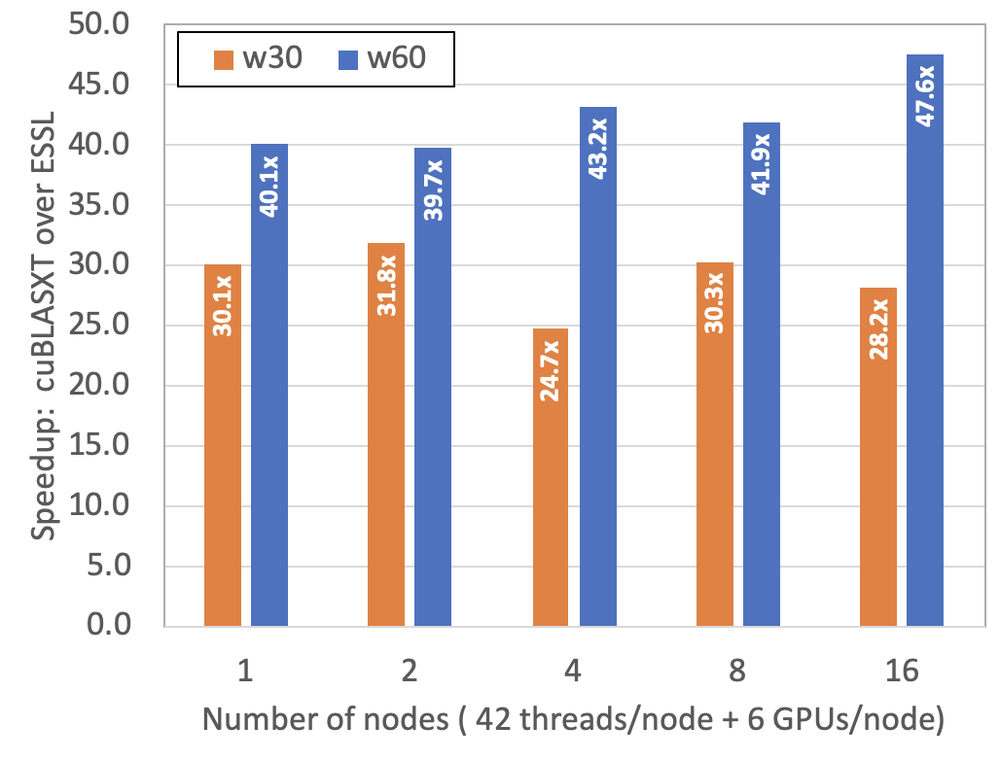

# GAMESS RI-MP2 mini-app

General Atomic and Molecular Electronic Structure System (GAMESS) 
is a popular quantum chemistry software package 
which has been around since the 1980s. 
It can calculate a wide variety of molecular properties 
using electronic structure methods. 
One of the methods implemented in GAMESS is 
resolution of identity Moller-Plesset perturbation (RI-MP2) theory. 
RI-MP2 is an electron correlation method, 
which is a class of methods 
that include instantaneous electron-electron interactions, 
and are required to perform accurate energy and property calcula- tions for certain classes of molecular systems. 
Of the electron correlation methods, 
RI-MP2 tends to be one of the more computationally inexpensive methods, 
but the formal computational complexity is still O(N5), 
where N is a measure of system size.   

The __GAMESS RI-MP2 mini-app__ computes 
__the correlation energy__
with the Hartree-Fock energy and wave-function given as inputs. 
The inputs were generated from GAMESS. 

## Inputs for GAMESS RI-MP2 mini-app
In this git repository, there is only one input file, benz.kern.
It is the smallest input. You can find bigger inputs at the following link:  
[https://anl.box.com/v/GAMESS-RI-MP2-Inputs](https://anl.box.com/v/GAMESS-RI-MP2-Inputs)    
On NVIDIA V100 GPUs, we recommend to use c60, w30, or w60 inputs to see meaningful speedups. 

## Running GAMESS RI-MP2 mini-app

### SUMMIT at OLCF

#### Build the executables
    rimp2-cublas:   rimp2 with OpenMP offloading + cublas on GPU,
    rimp2-cublasxt: rimp2 with OpenMP offloading + cublasxt on GPU,
    rimp2-nvblas:   rimp2 with OpenMP offloading + nvblas on GPU,
    rimp2-essl:     rimp2 with OpenMP threading  + ESSL on CPU, and
    rimp2-serial:   rimp2 with a single thread   + ESSL on CPU.
    
    $ source source_me_OLCF
    $ make clean
    $ make all
    

#### Run via an interactive job:
    $ bsub -P <your project code> -nnodes 1 -W 120 -Is /bin/bash
    $ source source_me_OLCF
    $ NMPI=x INPUT=xxx EXEC='rimp2-xxx rimp2-yyy' ./run_gpu.sh             
    $ NMPI=x NTHREAD=x INPUT=xxx EXEC='rimp2-zzz' ./run_cpu.sh
        # NMPI is the number of MPIs. If it doesn't exist, NMPI is set to 1.
        # NTHREAD is the number of OpenMP threads per MPI. If it doesn't exist, NTHREAD is set to min(42, 42*NNODES/NMPI).
        # INPUT is the input name. If it doesn't exist, INPUT is set to benz.kern.
        # EXEC is the executable name(s). If it doesn't exist. EXEC is set to 'rimp2-cublas rimp2-cublasxt rimp2-nvblas' for run_gpu.sh, and 'rimp2-essl rimp2-serial' for run_cpu.sh

#### Run via a batch job:
    $ bsub run_batch_OLCF_example.sh            
        # This example runs rimp2_gpu.sh and rimp2_cpu.sh (only with rimp2-essl) with two inputs (cor.kern, and c60.kern)
        #     on 4 SUMMIT nodes with 1, 2, 4, 6, 12, and 24 MPI ranks ( 1 GPU/MPI, 7 CPU threads/MPI).
        # You may modify this example script for your own tests.

### JLSE Skylake nodes at ALCF

#### Build the executables 
    rimp2-mkl:      rimp2 with OpenMP threading + MKL on CPU

    $ source source_me_JLSE_Intel
    $ make clean
    $ make all

#### Run via an interactive job:
    $ qsub -I -n 1 -t 120 -q skylake_8180
    $ source source_me_JLSE_Intel
    $ NMPI=x NTHREAD=x INPUT=xxx EXEC='rimp2-zzz' ./run_cpu.sh
        # NMPI is the number of MPIs. If it doesn't exist, NMPI is set to 1.
        # NTHREAD is the number of OpenMP threads per MPI. If it doesn't exist, NTHREAD is set to min(56, 56*NNODES/NMPI).
        # INPUT is the input name. If it doesn't exist, INPUT is set to benz.kern.
        # EXEC is the executable name(s). If it doesn't exist. EXEC is set to 'rimp2-mkl' for run_cpu.sh

#### Run via a batch job:
    $ qsub ./run_batch_JLSE_example.sh            
        # This example runs rimp2_cpu.sh with two inputs (cor.kern, and c60.kern)
        #     on 1 Skylake 8180 node with 1, 2, and 4 MPI ranks ( 56 threads in total).
        # You may modify this example script for your own tests.

### A quick test for build and validation
In order to build all executables and test them with benz.kern, you may run `./run_after_rebuild.sh`. The following is an example on SUMMIT:

    bash-4.2$ . source_me_OLCF 
    bash-4.2$ ./run_after_rebuild.sh 
    rm -rf *.o *.mod rimp2-nvblas rimp2-cublas rimp2-cublasxt rimp2-essl rimp2-serial
    mpifort -qsmp=omp -qoffload -qsuffix=cpp=f90 -DNVBLAS -g rimp2_energy_whole_KERN.f90 -o rimp2-nvblas -lnvblas -L/sw/summit/essl/6.1.0-2/essl/6.1/lib64 -lessl
    ** rimp2_shared   === End of Compilation 1 ===
    ** mp2correng   === End of Compilation 2 ===
    ** rimp2_trape_dec   === End of Compilation 3 ===
    ** rimp2_energy_whole   === End of Compilation 4 ===
    ** rimp2_energyij   === End of Compilation 5 ===
    1501-510  Compilation successful for file rimp2_energy_whole_KERN.f90.
    rm -rf *.o *.mod
    mpifort -qsmp=omp -qoffload -qsuffix=cpp=f90 -DCUBLAS -g -c cublasf.f90
    ** cublasf   === End of Compilation 1 ===
    1501-510  Compilation successful for file cublasf.f90.
    mpifort -qsmp=omp -qoffload -qsuffix=cpp=f90 -DCUBLAS -g rimp2_energy_whole_KERN.f90 -o rimp2-cublas -lcublas cublasf.o
    ** rimp2_shared   === End of Compilation 1 ===
    ** mp2correng   === End of Compilation 2 ===
    ** rimp2_trape_dec   === End of Compilation 3 ===
    ** rimp2_energy_whole   === End of Compilation 4 ===
    ** rimp2_energyij   === End of Compilation 5 ===
    1501-510  Compilation successful for file rimp2_energy_whole_KERN.f90.
    rm -rf *.o *.mod
    mpifort -qsmp=omp -qoffload -qsuffix=cpp=f90 -DCUBLASXT -g -c cublasf.f90
    ** cublasf   === End of Compilation 1 ===
    1501-510  Compilation successful for file cublasf.f90.
    mpifort -qsmp=omp -qoffload -qsuffix=cpp=f90 -DCUBLASXT -g rimp2_energy_whole_KERN.f90 -o rimp2-cublasxt -lcublas cublasf.o
    ** rimp2_shared   === End of Compilation 1 ===
    ** mp2correng   === End of Compilation 2 ===
    ** rimp2_trape_dec   === End of Compilation 3 ===
    ** rimp2_energy_whole   === End of Compilation 4 ===
    ** rimp2_energyij   === End of Compilation 5 ===
    1501-510  Compilation successful for file rimp2_energy_whole_KERN.f90.
    rm -rf *.o *.mod
    mpifort -qsmp=omp -qsuffix=cpp=f90 -DCPU -g  rimp2_energy_whole_KERN.f90 -o rimp2-essl -L/sw/summit/essl/6.1.0-2/essl/6.1/lib64 -lessl
    ** rimp2_shared   === End of Compilation 1 ===
    ** mp2correng   === End of Compilation 2 ===
    ** rimp2_trape_dec   === End of Compilation 3 ===
    ** rimp2_energy_whole   === End of Compilation 4 ===
    ** rimp2_energyij   === End of Compilation 5 ===
    1501-510  Compilation successful for file rimp2_energy_whole_KERN.f90.
    rm -rf *.o *.mod
    mpifort -qsmp=omp -qsuffix=cpp=f90 -g rimp2_energy_whole_KERN.f90 -o rimp2-serial -L/sw/summit/essl/6.1.0-2/essl/6.1/lib64 -lessl
    ** rimp2_shared   === End of Compilation 1 ===
    ** mp2correng   === End of Compilation 2 ===
    ** rimp2_trape_dec   === End of Compilation 3 ===
    ** rimp2_energy_whole   === End of Compilation 4 ===
    ** rimp2_energyij   === End of Compilation 5 ===
    1501-510  Compilation successful for file rimp2_energy_whole_KERN.f90.
    rm -rf *.o *.mod
    Running this script with 1 node(s) with up to 6 GPUs:
       NMPI is set to 2.
       INPUT is set to benz.kern. For another INPUT, use INPUT=xxxx before this job script.
       EXEC is set to rimp2-cublasxt rimp2-cublas rimp2-nvblas. For another EXEC, use EXEC='x y' before this job script.

    
    [[[Running rimp2-cublasxt with 2 MPI rank(s)...]]]
     You are running the code with cublasxt on GPU
         NQVV =        15
         Memory Footprint:
              B32(  39060,   15) =      4.6872 MB
              eij(     15,   15) =      0.0018 MB
              eab(     93,   93) =      0.0692 MB
              QVV(  93, 15,  93) =      1.0379 MB
    
         Results:
                                   Number of MPI ranks   =     2
                                   Number of OMP threads =     1
                 Rel. error of computed MP2 corr. energy =  0.28444E-15
                                   Wall time (minimum)   =    0.002 sec
                                   Wall time (mean)      =    0.003 sec
                                   Wall time (maximum)   =    0.004 sec
              Passed :-) 
    
    
    
    
    
    [[[Running rimp2-cublas with 2 MPI rank(s)...]]]
     You are running the code with cublas on GPU
         NQVV =        15
         Memory Footprint:
              B32(  39060,   15) =      4.6872 MB
              eij(     15,   15) =      0.0018 MB
              eab(     93,   93) =      0.0692 MB
              QVV(  93, 15,  93) =      1.0379 MB
    
         Results:
                                   Number of MPI ranks   =     2
                                   Number of OMP threads =     1
                 Rel. error of computed MP2 corr. energy =  0.28444E-15
                                   Wall time (minimum)   =    0.002 sec
                                   Wall time (mean)      =    0.002 sec
                                   Wall time (maximum)   =    0.002 sec
              Passed :-) 
    
    
    
    
    
    [[[Running rimp2-nvblas with 2 MPI rank(s)...]]]
    [NVBLAS] NVBLAS_CONFIG_FILE environment variable is NOT set : relying on default config filename 'nvblas.conf'
    [NVBLAS] Cannot Log File 'nvblas.log'
    [NVBLAS] Using devices :0 
    [NVBLAS] Config parsed
    [NVBLAS] NVBLAS_CONFIG_FILE environment variable is NOT set : relying on default config filename 'nvblas.conf'
    [NVBLAS] Cannot Log File 'nvblas.log'
    [NVBLAS] Using devices :0 
    [NVBLAS] Config parsed
     You are running the code with nvblas on GPU
         NQVV =        15
         Memory Footprint:
              B32(  39060,   15) =      4.6872 MB
              eij(     15,   15) =      0.0018 MB
              eab(     93,   93) =      0.0692 MB
              QVV(  93, 15,  93) =      1.0379 MB
    
         Results:
                                   Number of MPI ranks   =     2
                                   Number of OMP threads =     1
                 Rel. error of computed MP2 corr. energy =  0.28444E-15
                                   Wall time (minimum)   =    0.002 sec
                                   Wall time (mean)      =    0.003 sec
                                   Wall time (maximum)   =    0.004 sec
              Passed :-) 
    
    
    
    Running this script with 1 node(s) with up to 42 CPU threads in total:
       NMPI is set to 2.
       NTHREAD is set to 21. For another NTHREAD, use NTHREAD=x before this job script.
       INPUT is set to benz.kern. For another INPUT, use INPUT=xxxx before this job script.
       EXEC is set to rimp2-essl rimp2-serial. For another EXEC, use EXEC='x y' before this job script.
    
    
    [[[Running rimp2-essl with 2 MPI rank(s) and 21 threads/MPI ...]]]
     You are running the code with CPU OpenMP
         NQVV =        15
         Memory Footprint:
              B32(  39060,   15) =      4.6872 MB
              eij(     15,   15) =      0.0018 MB
              eab(     93,   93) =      0.0692 MB
              QVV(  93, 15,  93) =      1.0379 MB
    
         Results:
                                   Number of MPI ranks   =     2
                                   Number of OMP threads =    21
                 Rel. error of computed MP2 corr. energy =  0.00000E+00
                                   Wall time (minimum)   =    0.004 sec
                                   Wall time (mean)      =    0.005 sec
                                   Wall time (maximum)   =    0.006 sec
              Passed :-) 
    
    
    
    
    
    [[[Running rimp2-serial with 2 MPI rank(s) and 21 threads/MPI ...]]]
     You are running the code serially
         NQVV =        15
         Memory Footprint:
              B32(  39060,   15) =      4.6872 MB
              eij(     15,   15) =      0.0018 MB
              eab(     93,   93) =      0.0692 MB
              QVV(  93, 15,  93) =      1.0379 MB
    
         Results:
                                   Number of MPI ranks   =     2
                                   Number of OMP threads =    21
                 Rel. error of computed MP2 corr. energy =  0.00000E+00
                                   Wall time (minimum)   =    0.021 sec
                                   Wall time (mean)      =    0.023 sec
                                   Wall time (maximum)   =    0.025 sec
              Passed :-) 
    
    
    
    bash-4.2$ 
 

## Figure-of-Merit (FOM)

The Figure-of-Merit (FOM) is the time-to-solution of the input. The mini-app reports three walltimes from MPI ranks: minimum, mean, and maximum. The time-to-solution (TTS) is the maximum wall time. For the baseline benchmark, use `w60.kern`. The reference data on SUMMIT are as follows:

<table>
    <thead>
    <tr>
        <td align="center" colspan="2">  </td>
        <td align="center" colspan="3">w30.kern </td>
        <td align="center" colspan="3">w60.kern </td>
    </tr><tr>
        <td align="center">Number of Nodes </td> 
        <td align="center">NMPI </td> 
        <td align="center">rimp2-cublas</td>
        <td align="center">rimp2-cublasxt</td>
        <td align="center">rimp2-essl</td>
        <td align="center">rimp2-cublas</td>
        <td align="center">rimp2-cublasxt</td>
        <td align="center">rimp2-essl</td>
    </tr>
    </thead>
    <tbody>
    <tr>
        <td align="center">1 </td>
        <td align="center">1 </td>
        <td align="center">2.899 </td>
        <td align="center">2.314 </td>
        <td align="center">86.324 </td>
        <td align="center">87.301 </td>
        <td align="center">72.903 </td>
        <td align="center">2727.419 </td>
    </tr><tr>
        <td align="center">1 </td>
        <td align="center">2 </td>
        <td align="center">1.582 </td>
        <td align="center">1.287 </td>
        <td align="center">43.848 </td>
        <td align="center">44.646 </td>
        <td align="center">37.512 </td>
        <td align="center">1386.807 </td>
    </tr><tr>
        <td align="center">1 </td>
        <td align="center">4 </td>
        <td align="center">0.899 </td>
        <td align="center">0.759 </td>
        <td align="center">26.768 </td>
        <td align="center">23.181 </td>
        <td align="center">19.67 </td>
        <td align="center">792.305 </td>
    </tr><tr>
        <td align="center">1 </td>
        <td align="center">6 </td>
        <td align="center">0.664 </td>
        <td align="center">0.643 </td>
        <td align="center">19.333 </td>
        <td align="center">16.08 </td>
        <td align="center">14.074 </td>
        <td align="center">563.707 </td>
    </tr><tr>
        <td align="center">2 </td>
        <td align="center">12 </td>
        <td align="center">0.447 </td>
        <td align="center">0.397 </td>
        <td align="center">12.626 </td>
        <td align="center">8.845 </td>
        <td align="center">7.999 </td>
        <td align="center">317.892 </td>
    </tr><tr>
        <td align="center">4 </td>
        <td align="center">24 </td>
        <td align="center">0.402 </td>
        <td align="center">0.379 </td>
        <td align="center">9.358 </td>
        <td align="center">5.383 </td>
        <td align="center">4.921 </td>
        <td align="center">212.748 </td>
    </tr><tr>
        <td align="center">8 </td>
        <td align="center">48 </td>
        <td align="center">0.337 </td>
        <td align="center">0.308 </td>
        <td align="center">9.347 </td>
        <td align="center">3.722 </td>
        <td align="center">3.687 </td>
        <td align="center">154.441 </td>
    </tr><tr>
        <td align="center">16 </td>
        <td align="center">96 </td>
        <td align="center">0.358 </td>
        <td align="center">0.332 </td>
        <td align="center">9.349 </td>
        <td align="center">2.923 </td>
        <td align="center">3.169 </td>
        <td align="center">150.704 </td>
    </tr>
    </tbody>
<caption> Time-to-Solution in second (1 GPU/MPI for rimp2-cublas & rimp2-cublasxt, 7 threads/MPI for rimp2-essl)</caption>
</table>

   

