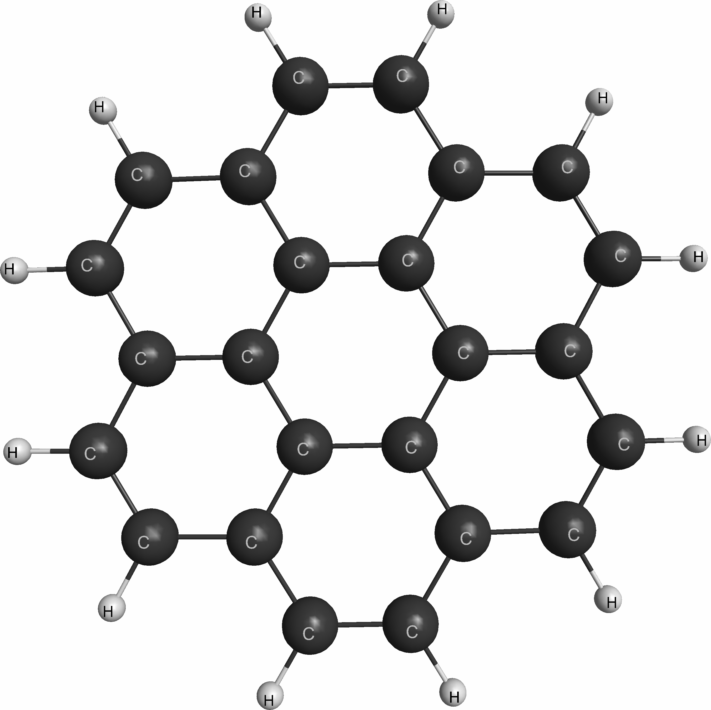
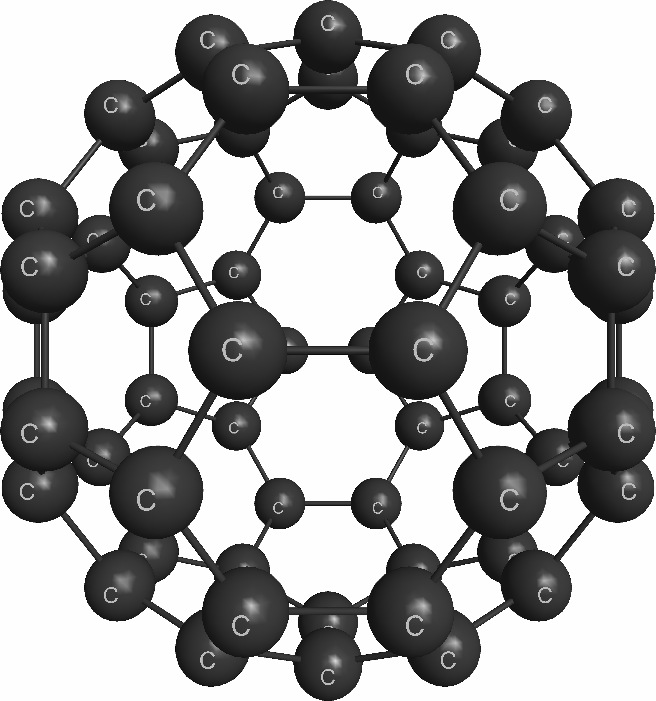

# GAMESS RI-MP2 mini-app for SC21 Roofline tutorial

This is a simplifed version of GAMESS RI-MP2 mini-app for SC21 Roofline tutorial.  
For more details about GAMESS RI-MP2 mini-app, please visit the following github repository:  
https://github.com/jkwack/GAMESS_RI-MP2_MiniApp

General Atomic and Molecular Electronic Structure System (GAMESS) 
is a popular quantum chemistry software package 
which has been around since the 1980s. 
It can calculate a wide variety of molecular properties 
using electronic structure methods. 
One of the methods implemented in GAMESS is 
resolution of identity Moller-Plesset perturbation (RI-MP2) theory. 
RI-MP2 is an electron correlation method, 
which is a class of methods 
that include instantaneous electron-electron interactions, 
and are required to perform accurate energy and property calcula- tions for certain classes of molecular systems. 
Of the electron correlation methods, 
RI-MP2 tends to be one of the more computationally inexpensive methods, 
but the formal computational complexity is still O(N5), 
where N is a measure of system size.   

The __GAMESS RI-MP2 mini-app__ computes 
__the correlation energy__
with the Hartree-Fock energy and wave-function given as inputs. 
The inputs were generated from GAMESS. 

## Inputs for GAMESS RI-MP2 mini-app

### Input data sets from GAMESS
Input data sets for GAMESS RI-MP2 mini-app include several fundamental parameters 
(e.g., the number of atomic orbital (N) and auxiliary (X) basis functions, 
the number of correlated occupied (O) and virtual (V) molecular orbitals), 
the molecular orbital coefficients, the molecular orbital energies, 
and 3-index integral matrix B(X,V,O)), and the calculated MP2 correlation energy for validation. 
The following input data sets were generated from GAMESS:
* benz.kern for Benzene
* cor.kern for Coronene
* c60.kern for Fullerene
* w30.kern for 30 water clusters
* w60.kern for 60 water clusters

In this git repository, there is only one input file, benz.kern.
It is the smallest input. You can find bigger inputs at the following link:  
[https://anl.box.com/v/GAMESS-RI-MP2-Inputs](https://anl.box.com/v/GAMESS-RI-MP2-Inputs)  
On NVIDIA V100 GPUs, we recommend to use c60.kern, w30.kern, or w60.kern inputs to see meaningful speedups. 

| cor.kern  | c60.kern  | w60.kern  |
| :-:       |:-:        | :-:       |
| | |   |

### Arbitrary data sets with the same data structures as the above inputs
The above data sets require significant I/O times before computing the correlation energy. They are not necessary in actual GAMESS workloads. In order to avoid the unnecessary I/O time, the following arbitrary data sets can be generated via the initialization process:
* benz.rand: an arbitrary data with the same data structure of benz.kern
* cor.rand: an arbitrary data with the same data structure of cor.kern
* c60.rand: an arbitrary data with the same data structure of c60.kern
* w25.rand: an arbitrary data for 25 water clusters
* w30.rand: an arbitrary data with the same data structure of w30.kern
* w60.rand: an arbitrary data with the same data structure of w60.kern

## Running GAMESS RI-MP2 mini-app

### Intel DevCould

#### Build the executables
    $ git clone --single-branch --branch tutorial-SC21 https://github.com/jkwack/GAMESS_RI-MP2_MiniApp.git
    $ cd GAMESS_RI-MP2_MiniApp/CPP/
    $ make all

  
#### Start an interactive job with an Intel Gen9 node:
    qsub -I -l nodes=1:gpu:ppn=2 -d .

### JLSE IRIS nodes at ALCF

#### Build the executables 
    rimp2-V0-CPU: an initial version
    rimp2-V1-CPU: QVV with MKL DGEMM
    rimp2-V3-GPU: offloaded to GPU
    rimp2-V5-GPU: restructured for better performance on GPU

    $ git clone --single-branch --branch tutorial-SC21 https://github.com/jkwack/GAMESS_RI-MP2_MiniApp.git
    $ module load oneapi
    $ cd GAMESS_RI-MP2_MiniApp
    $ cd CPP
    $ make all

#### Start an interactive job with an IRIS node:
    $ qsub -I -n 1 -t 360 -q iris

## Examples of runs

### A quick test for build and validation
The following is an example of building and running this mini-app on JLSE (i.e., Argonne testbed system):

    $ cd GAMESS_RI-MP2_MiniApp_Dev/CPP
    $ module load oneapi
    $ make all
      icpc -Ofast -g -xCORE-AVX2 GAMESS-RIMP2-CorrEng-Tutorial.cpp RIMP2_V0_CPU.cpp -o rimp2-V0-CPU 
      icpc -Ofast -g -xCORE-AVX2 -DMKL GAMESS-RIMP2-CorrEng-Tutorial.cpp RIMP2_V1_CPU.cpp -o rimp2-V1-CPU -qmkl=sequential
      icpx -fiopenmp -DOFFLOAD -g -O3 -fopenmp-targets=spir64 -fsycl -DMKL GAMESS-RIMP2-CorrEng-Tutorial.cpp RIMP2_V3_GPU.cpp -o rimp2-V3-GPU -qmkl 
      icpx -fiopenmp -DOFFLOAD -g -O3 -fopenmp-targets=spir64 -fsycl -DMKL GAMESS-RIMP2-CorrEng-Tutorial.cpp RIMP2_V5_GPU.cpp -o rimp2-V5-GPU -qmkl 
    $ ./rimp2-V5-GPU w25.rand
	Generating arbitrary input data with the structure of w25.kern
	NAUXBASD NCOR NACT NVIR NBF = 2100 25 100 475 625
	Memory Footprint:
		B32[ 997500 , 100 ] = 798 MB
		eij[ 100 , 100 ] = 0.08 MB
		eab[ 475 , 475 ] = 1.805 MB
		QVV[ 475 , 100 , 475 ] = 180.5 MB

	Running the code with OpenMP offloading on GPU with MKL...
	Done
		Rel. error of computed MP2 corr. energy = 1.5999e-14
		Wall time                               = 24.8179 sec
		Passed :-) 

